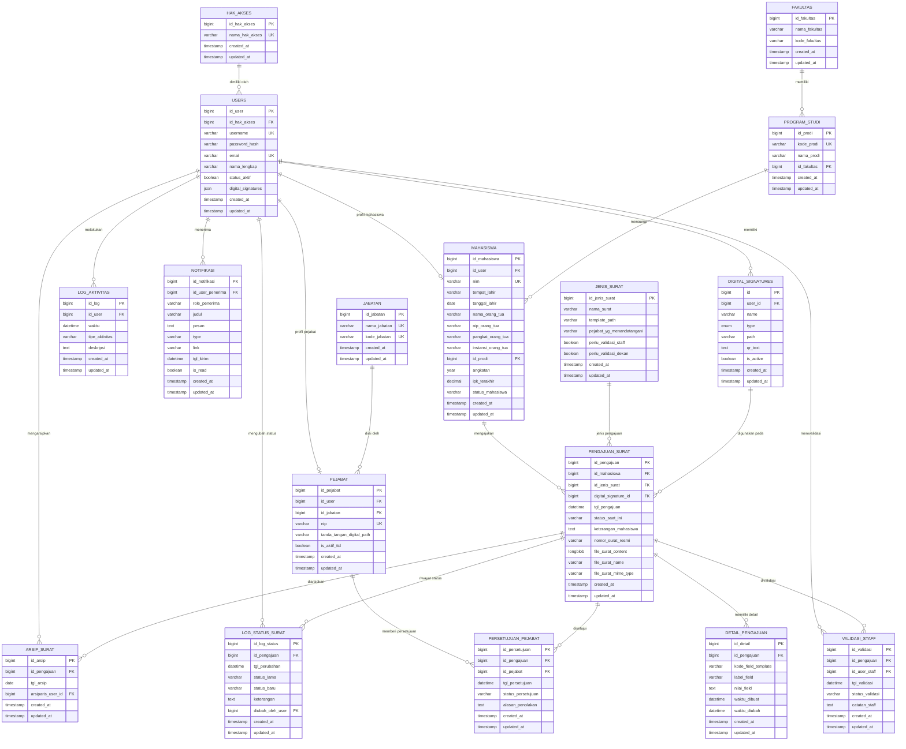

# ERD Revisi - Sistem Pengajuan Surat

## Catatan Revisi

- Tabel `jabatan` yang dobel di ERD lama dipisahkan menjadi `pejabat` dan `jabatan`.
- Atribut `username`, `password`, `email`, `nama_lengkap`, dan `status_aktif` dipindahkan ke `users`, bukan `notifikasi`.
- `log_aktivitas` direlasikan ke `users`, bukan langsung ke `pengajuan_surat`.
- Ditambahkan tabel `fakultas` karena `program_studi` sekarang punya `id_fakultas`.
- Ditambahkan tabel `digital_signatures` dan relasinya ke `users` serta `pengajuan_surat`.
- Kolom file final pada `pengajuan_surat` dirapikan sesuai migration terbaru: `file_surat_content`, `file_surat_name`, dan `file_surat_mime_type`.
- `jenis_surat` ditambahkan kolom `perlu_validasi_dekan`.
- `log_status_surat` ditambahkan `status_lama` dan `keterangan`.
